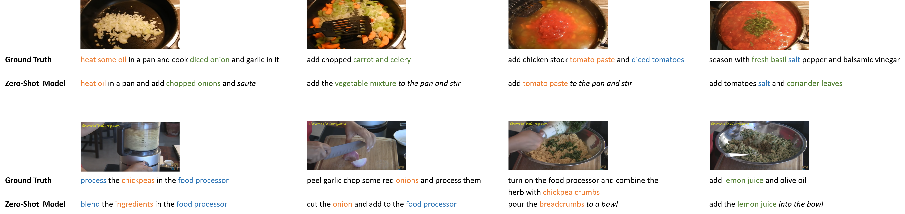

# Zero-Shot Learning for Video Captioning of Instructional Cooking Videos

##### Authors 
* Marie Wirsching (marie.wirsching@tum.de) 
* Marie Brei (marie.brei@tum.de)

This repository contains code for a sequence-to-sequence model with attention mechanism for video captioning 
in the Zero-Shot setting. We adapted the model architecture for Zero-Shot Learning (ZSL) and the 
[YouCook2 dataset](http://youcook2.eecs.umich.edu/) on the basis of the work from <sup>1</sup>
and show strong captioning capabilities for videos of recipe types 
that have never been seen at training time. Some exemplary captioning results are shown in the following figure.
<br /><br />


## Requirements 

### Computational requirements and required packages (Recommended)
1. GPU: NVIDIA Tesla P100 x1 
2. Pytorch 1.1
3. All the other required packages can be found in `requirements.txt`

### Required data files 

All of the data files should be downloaded, decompressed  stored under `~/FoodVid2Cap/data/`. The full path to the data directory should
be adjusted in the `config.py` file.

1. [Annotations from YouCook2](http://youcook2.eecs.umich.edu/static/YouCookII/youcookii_annotations_trainval.tar.gz)
2. [ResNet features from YouCook2](http://youcook2.eecs.umich.edu/static/YouCookII/feat_csv.tar.gz)
3. ResNet and motion feature files from [DenseCap](https://github.com/LuoweiZhou/densecap) <sup>(*)</sup> <br />
Avaiable for their specific splits: 
[train (27.7GB)](http://youcook2.eecs.umich.edu/static/dat/anet_densecap/training_feat_anet.tar.gz),
[val (13.7GB)](http://youcook2.eecs.umich.edu/static/dat/anet_densecap/validation_feat_anet.tar.gz), 
[test (13.6GB)](http://youcook2.eecs.umich.edu/static/dat/anet_densecap/testing_feat_anet.tar.gz) 
should be decompressed and placed under `~/FoodVid2Cap/data/video_features` 
3. [Recipe types from YouCook2](http://youcook2.eecs.umich.edu/static/YouCookII/label_foodtype.csv)
4. [Recipe1M vocabulary](http://data.csail.mit.edu/im2recipe/recipe1M_pretrained/vocab.bin.gz)
5. [Recipe1M layers](http://data.csail.mit.edu/im2recipe/recipe1M_layers.tar.gz)


<sup>(*)</sup> Not necessary to download when working only with the ResNet features from the YouCook2 dataset


## Pipeline 
#### 1. Data Preprocessing
##### 1.1 Load and build the vocabulary `src/data/load_build_vocab.py`
Script for building the required vocabulary <br /><br/>
**Arguments:** <br />
`--recipe1M` boolean variable that specifies whether the vocabulary should 
be built from the plain annotations of the YouCook2 dataset or the Recipe1M dataset.
*True* for  using the recipe1M dataset <br />
`--threshold` minimum amount of word counts for a word to be incorporated into the vocabulary. 
The default is set to zero <br />

*Note that one has to specify the root path of the project in the import section at the 
beginning of the script with sys.path.append(...) in order to import own modules*

##### 1.2 Build features and index data file `src/data/build_video_features.py`
Script for building the video features for the relevant segments of the video sequences and 
storing them as numpy files. Additionally, an index data file is built that holds the references to the feature files 
as well as the corresponding recipe types. Furthermore, this data file stores the belonging of each video sequence to
the train, validation or test dataset. The video sequences are split such that the 89 recipes are divided to train, validation 
and test set at a ratio of 75, 7 and 7. This specific data split ensures the Zero-Shot setting. <br/><br/>
**Arguments:**<br />
`--resNet` build the video features on the basis of the provided ResNet features 
from the [YouCook2 dataset](http://youcook2.eecs.umich.edu/)  <br />
`--bn` build the video features on the basis of the provided motion features
 (with suffix _bn.npy) from [DenseCap](https://github.com/LuoweiZhou/densecap)
 
 *Note that one has to specify the root path of the project in the import section at the 
beginning of the script with sys.path.append(...) in order to import own modules*

 
##### 1.3 Build tfidf topic embeddings `src/data/build_tfidf_from_recipe1M.py`
Script for building the tfidf based embeddings for each recipe type. 

#### 2.Training
The training process of the model can be executed via the jupyter notebook `Train_model.ipynb` under `~/FoodVid2Cap/notebooks`
 or with the **launcher** script under `src/launcher.py` <br />
 The training and validation scores as well as the models are stored under `~/FoodVid2Cap/models`
 in a folder that is named after the timestamp at the start of the training process. 
 
 
Arguments for the launcher that can be set for the training process: <br />

`--recipe1M` boolean variable which specifies which vocabulary and embeddings to use. *True* for using the enlarged vocabulary and embeddings of the recipe1M dataset <br/>
`--resNet` boolean varibale which specifies which features to use. *True* for using the ResNet features <br/>
`--moe` boolean varibale which specifies whether the model should be trained with the Mixture of Experts (MoE) layer.<br />
`--num_experts` specifies the number of experts for the MoE layer<br />
`--num_epochs` specifies the number of epochs for training the model<br/>
`--print_every` specifies the frequency of printing the training and validaiton results and saving the model <br/>
`--learning_rate` specifies the learning rate for the Adam optimizer<br/>
`--batch_size` specifies the batch size for each iteration<br/>
`--teaching_forcing_ratio` During training, the teacher forcing ratio can be between 0 and 1 <br />
`--limit` specifies the length of the generated output sequence. If set to zero the length equals to the maximum length of the annotations in the training dataset<br/>
`--num_train` specifies the number of samples in training <br/>
`--num_val` specifies the number of samples in validation <br/>
<br/>
The following command resembles the parameter setting for training of the Zero-Shot model 
```
python launcher.py --resNet --recipe1M --moe --num_experts 8 --num_epochs 250
--print_every 20  --learning_rate 0.001 --batch_size 256 --teacher_forcing_ratio 0.8
--limit 0 --num_train 11711 --num_val 1016
```

With the notebook `Plots.ipynb` one can reproduce the plots of the training loss curve 
as well as the plots for the evaluation scores on the training and validation set during 
training for a specific training process that can be indicated with the corresponding model path. 

#### 3.Prediction and Evaluation on the test set
The captioning capabilities of the model are evaluated on an unseen test dataset which is compromised by 
7 recipe types that were never seen during the training process. The assessment of the model's captioning capability is
recorded by several standard metrics that are commonly used in the field of natural 
language generation. These include the METEOR <sup>2</sup> and ROUGE-L score <sup>3</sup>. With [pycocoeval](https://github.com/tylin/coco-caption) further evaluation scores can be caculated.
 
##### 3.1 Generate captions for the test data `Generate_captions_test.ipynb` 
Notebook that produces the captions for the unseen test set. In the notebook one can specify the path to the model that 
should be loaded and used to generate the captions. 
##### 3.2 Evaluate generated captions - quantitative and qualitative `Investigate_predictions.ipynb`
Notebook to calculate the mentioned evaluation scores on the test set and perform some more
in-depth analysis of the results on a recipe type level. 
## References 
<sup>1</sup> *Wang, Xin, et al. "Learning to compose topic-aware mixture of experts for 
zero-shot video captioning." Proceedings of the AAAI Conference on Artificial 
Intelligence. Vol. 33. 2019.* <br />
Available from: https://wvvw.aaai.org/ojs/index.php/AAAI/article/view/4926/4799

<sup>2</sup> *Banerjee, Satanjeev, and Alon Lavie. "METEOR: An automatic metric for MT
 evaluation with improved correlation with human judgments." Proceedings of the acl 
 workshop on intrinsic and extrinsic evaluation measures for machine translation 
 and/or summarization. 2005.* <br/> Available from: https://www.aclweb.org/anthology/W05-0909
 
 <sup>3</sup> *Lin, Chin-Yew. "Rouge: A package for automatic evaluation of summaries."
  Text summarization branches out. 2004.* <br /> 
  Available from: https://www.aclweb.org/anthology/W04-1013
 